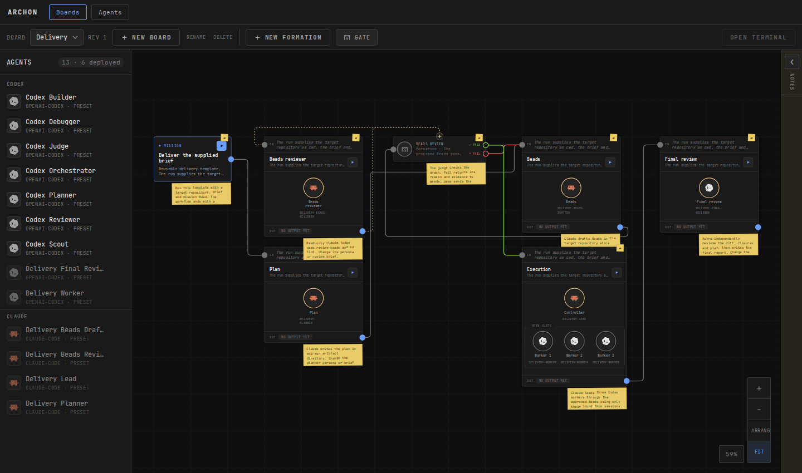
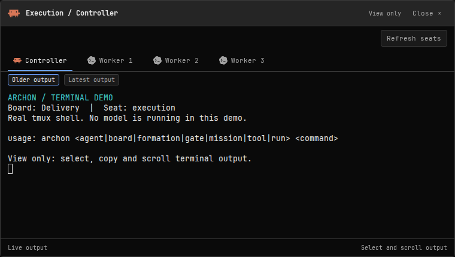
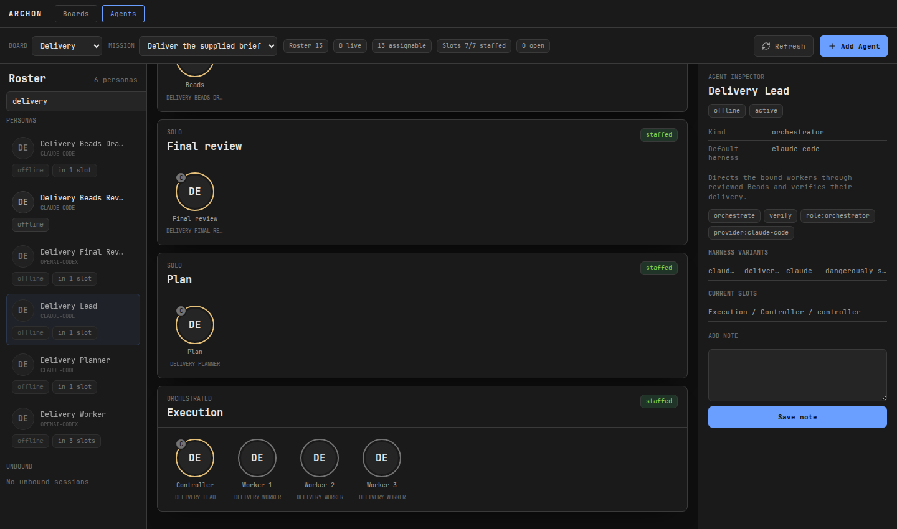

# Archon

A workbench for teams of coding agents. Draw the work, assign Claude Code and
Codex agents, and decide where a review or human approval must happen before
the next step runs.

Archon combines a visual board editor, a CLI and a local coordinator. Agents
work in tmux sessions on your machine. The UI shows their assignments and
terminal output; the coordinator routes results through the graph and keeps
the run history on disk.



The included delivery board plans a change, drafts Beads, reviews the proposed
work, then hands execution to a Claude controller with three Codex workers.
A final reviewer checks the result. A failed Beads review sends feedback back
to the drafting step.

## Work you can inspect

- Use a solo agent, peer agents, or a controller with assigned workers.
- Give each step its own brief, input and output ports, and agent settings.
- Add code checks, agent reviews and human approval gates. Route failures back
  for another attempt, within the run's limits.
- Keep several missions running with separate briefs, working directories,
  cancellation and histories.
- Click a mission, formation or gate to open it in a floating window. Read its
  full text, staffing and routes, and edit any field in place, with undo.
- Open a floating terminal Peek to talk with a seat's agent, even while it
  works, and to select, copy and scroll its output. The terminal follows the
  window's size. Open one per formation, then move, resize and stack the
  windows over the canvas.



This capture uses a real tmux shell running CLI help. It is labelled as a demo;
no model is running in it.

The Agents view keeps reusable personas beside the mission's staffing. Inspect
and edit a persona and see which slots use it. It shows the mission's current
run read-only and links to Boards, where runs start and gates are answered.



## Install

The Linux release includes the CLI, daemon, UI, examples and documentation in
one archive. Choose `amd64` for x86-64 machines or `arm64` for ARM64, then
download the archive and `SHA256SUMS` from the
[latest release](https://github.com/Perttulands/Archon-agentgraphs/releases/latest).
No Go, Node or frontend server is needed to use the release.

For the x86-64 release:

```bash
sha256sum --ignore-missing --check SHA256SUMS
tar -xzf archon-0.1.0-linux-amd64.tar.gz
cd archon-0.1.0-linux-amd64
./install.sh --prefix "$HOME/.local"
export PATH="$HOME/.local/bin:$PATH"
archon --version
archond --version
```

The installer defaults to `$HOME/.local`. Use `--prefix /absolute/path` to
choose another location. It installs `bin/archon`, `bin/archond` and the
`formationsd` compatibility command, with complete releases under
`lib/archon/releases/` and a `lib/archon/current` link.
The daemon finds the installed UI automatically. Keep runtime state in a
separate directory so replacing a release leaves boards and history intact.

| Part | Role |
| --- | --- |
| `archon` | Author boards locally and send runtime commands to the daemon. |
| `archond` | Run missions, manage agent seats, persist events and serve the UI. |
| `share/archon/ui/` | Browser UI included in the release. |

Archon was previously called Formations. Existing `formationsd` commands,
`.formations` storage and `/api/formations` routes still work. A formation is
also the name of an execution node. CHROTE is not required.

## Try the UI

After installing to `$HOME/.local`, import the delivery example and start a
lab daemon. Lab lets you explore boards without launching agents.

```bash
export ARCHON_STATE="${XDG_DATA_HOME:-$HOME/.local/share}/archon/state"
export ARCHON_SHARE="$HOME/.local/lib/archon/current/share/archon"
umask 077
mkdir -p "$ARCHON_STATE/.formations/boards" "$ARCHON_STATE/.formations/notes"
cp "$ARCHON_SHARE/examples/delivery.formation.toml" "$ARCHON_STATE/.formations/boards/"
cp "$ARCHON_SHARE/examples/delivery.notes.toml" "$ARCHON_STATE/.formations/notes/"
archon --workspace "$ARCHON_STATE" board validate delivery --json
archon --workspace "$ARCHON_STATE" board arrange delivery --json
archond --executor lab --state-dir "$ARCHON_STATE" --listen 127.0.0.1:8091
```

For a custom install prefix, set `ARCHON_SHARE` to its
`lib/archon/current/share/archon` directory
and add its `bin` directory to `PATH`.

Open **http://127.0.0.1:8091**. Leave the daemon running in this terminal and
stop it with Ctrl+C when finished. Lab simulates execution; it does not perform
the work in a brief. The service has no authentication, so keep its listeners
on trusted interfaces.

## Run real agents

Install tmux and the Claude Code or Codex CLI required by your chosen personas,
and authenticate those CLIs. Start the daemon with `--executor tmux` and your
absolute paths for `--socket`, `--tmux-bin`, `--codex-transcripts` and
`--claude-transcripts`. The daemon creates seats on demand when a formation
runs. See the [operator procedure](docs/CONTRACT.md#operator-procedure) for
configuration, execution limits, approvals and recovery.

The delivery example also expects Beads and the shared skills named in its
briefs. Those tools and skills are not bundled here. Read and adapt the
[board](examples/delivery.formation.toml) and its
[notes](examples/delivery.notes.toml) before running it against a repository.
The [minimal board](docs/CONTRACT.md#definitions-and-storage) is a smaller
starting point for your own workflow.

With a configured daemon and a prepared delivery board, submit a mission from
another terminal. Replace the working directory, brief and Bead below with
your task's values.

```bash
archon --server http://127.0.0.1:8091 mission run delivery \
  --mission mis_delivery --cwd /absolute/path/to/your/repository \
  --brief /absolute/path/to/your/brief.md --bead your-project-123 \
  --max-dispatch 30 --max-attempts 3 --wall-clock-seconds 7200 --json
```

Use the returned run ID with `run status`, `run logs`, `run follow` or
`run abort`. Runtime commands always use `--server`; local authoring uses
`--workspace`. A run keeps a snapshot of its board and personas, so later
edits apply to later runs. Recovery records unresolved work explicitly;
inspect a blocked run before deciding how to continue it.

## Build from source

Build on Linux with Go 1.26.6 or newer and Node 20.19+ in the 20.x line, or
Node 22.12+. The build script creates both Linux architectures by default;
select one with `--arch amd64` or `--arch arm64`.

```bash
git clone https://github.com/Perttulands/Archon-agentgraphs.git archon
cd archon
./scripts/build-release.sh --out "$PWD/release" --arch amd64
```

Install the resulting archive as above. See [release packaging](docs/releasing.md)
for the archive layout, checks and publication procedure.

## Develop

```bash
(cd src && go test ./...)
(cd dashboard && npm run test:unit && npm run build && npm run lint)
```

For Vite development, set `FORMATIONS_API_URL` to the daemon URL and run
`npm run dev` in `dashboard/`.

| Source | Owns |
| --- | --- |
| `src/internal/formations/` | Model, persistence, gates and execution. |
| `src/internal/coordinator/` | Admission, runtime commands and projections. |
| `src/internal/api/` | Authoring HTTP and local adapters. |
| `src/internal/daemon/` | `archond` flags, executor wiring and startup. |
| `src/cmd/archon/`, `src/cmd/archond/`, `src/cmd/formationsd/` | CLI and daemon entrypoints. |
| `dashboard/` | Board editor, agent staffing and terminal Peek. |

Read the [runtime contract](docs/CONTRACT.md),
[daily-capability decisions](docs/adr/0016-daily-capability.md) and
[OpenAPI specification](docs/openapi/formations.yaml) before changing runtime
behavior. Host deployment and CHROTE integration live outside this repository.
Historical designs remain in [the archive](docs/archive/).

[MIT license](LICENSE). [Image sources and capture notes](docs/images/README.md).
